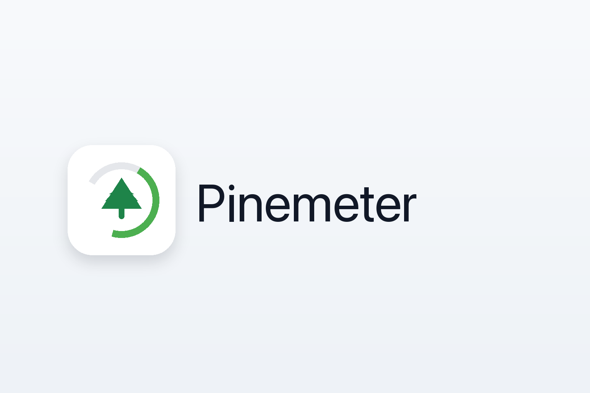

# Pinemeter



Keep track of your Claude.ai plan usage at a glance.

## Features

- **Real-time usage monitoring** - Track your 5-hour session, 7-day weekly, and Sonnet-specific usage limits
- **Menu bar integration** - Clean, colour-coded usage indicator that lives in your macOS menu bar
- **Multiple icon styles** - Choose from 6 icon styles: Battery, Circular, Minimal, Segments, Dual Bar, or Gauge
- **Pacing indicator** - Flame icon warns when you're using Claude faster than sustainable pace
- **Smart notifications** - Configurable alerts at warning and critical thresholds (defaults: 75% and 90%)
- **Auto-refresh** - Automatic usage updates every 1 minute, 5 minutes, or 10 minutes

## Screenshots

### Menu Bar

The menu bar icon changes colour based on your usage levels:

<p align="center">
  
  
  
</p>

When using Sonnet models, an additional indicator shows your Sonnet-specific usage:

<p align="center">
  
</p>

### Notifications

Pinemeter sends native macOS notifications when you reach warning or critical thresholds:

<p align="center">
  
</p>

### Settings

Configure your Claude session, refresh interval, icon style, and notification thresholds:

<p align="center">
  
  
</p>

### Setup Wizard

<p align="center">
  
</p>

## Installation

### Manual Download

1. Download the latest Pinemeter release from this repository's Releases page.
2. Unzip and move `Pinemeter.app` to Applications.
3. Double-click to open.

Release distribution, Homebrew packaging, and final public repository URLs are pending the open-source hygiene plan.

## Usage

### First Launch

1. Pinemeter appears in your menu bar as a gauge icon
2. The setup wizard will guide you through initial configuration
3. Import from a browser signed in to [claude.ai](https://claude.ai), or paste your session manually
4. The app validates your session and begins monitoring usage

### Claude Session Setup

Pinemeter can import your existing Claude session from local browser cookies. Sign in to [claude.ai](https://claude.ai) in a supported browser, then choose **Import from Browser** in the setup wizard or Settings.

Chrome, Arc, Brave, Edge, and other Chromium browsers may ask for browser Safe Storage Keychain access so Pinemeter can decrypt cookies. Safari cookies are protected by macOS and may require Full Disk Access.

If browser import is unavailable, paste your session manually. Pinemeter accepts either a raw `sk-ant-...` session key or a Cookie header containing `sessionKey=...`.

#### Manual Session Setup

Your Claude session key is stored in your browser cookies.

**Chrome/Edge:**

1. Open [claude.ai](https://claude.ai)
2. Press `F12` to open DevTools
3. Go to Application > Cookies > `https://claude.ai`
4. Find the `sessionKey` cookie (starts with `sk-ant-`)
5. Copy the value

**Safari:**

1. Open [claude.ai](https://claude.ai)
2. Go to Develop > Show Web Inspector (enable Develop menu in Safari preferences if needed)
3. Go to Storage > Cookies > `https://claude.ai`
4. Find the `sessionKey` cookie (starts with `sk-ant-`)
5. Copy the value

**Firefox:**

1. Open [claude.ai](https://claude.ai)
2. Press `F12` to open Developer Tools
3. Go to Storage > Cookies > `https://claude.ai`
4. Find the `sessionKey` cookie (starts with `sk-ant-`)
5. Copy the value

### Daily Use

- Monitor your usage at a glance with the colour-coded menu bar icon
- Click the icon to access detailed statistics and adjust settings
- Receive automatic notifications when reaching warning or critical thresholds

### Integration with External Tools

Pinemeter exports usage data to `~/.pinemeter/usage.json` for use with external tools like Claude Code statusline scripts, shell prompts, or custom dashboards.

**JSON format:**

```json
{
  "last_updated": "2025-12-24T07:30:00Z",
  "session_usage": {
    "reset_at": "2025-12-24T12:00:00Z",
    "utilization": 29
  },
  "sonnet_usage": {
    "reset_at": "2025-12-30T00:00:00Z",
    "utilization": 15
  },
  "weekly_usage": {
    "reset_at": "2025-12-30T00:00:00Z",
    "utilization": 45
  }
}
```

**Example: Claude Code statusline**

Create `~/.claude/statusline.sh`:

```bash
#!/bin/bash
usage=$(jq -r '.session_usage.utilization' ~/.pinemeter/usage.json 2>/dev/null)

if [ -z "$usage" ] || [ "$usage" = "null" ]; then
  echo "Usage: ~"
elif [ "$usage" -lt 50 ]; then
  echo -e "\033[32mUsage: ${usage}%\033[0m"
elif [ "$usage" -lt 80 ]; then
  echo -e "\033[33mUsage: ${usage}%\033[0m"
else
  echo -e "\033[31mUsage: ${usage}%\033[0m"
fi
```

Then configure Claude Code's `~/.claude/settings.json`:

```json
{
  "statusLine": {
    "type": "command",
    "command": "bash ~/.claude/statusline.sh"
  }
}
```

## Requirements

- macOS 14.0 (Sonoma) or later
- Active Claude.ai account with a browser session or session key
- For browser import, a supported browser signed in to [claude.ai](https://claude.ai)

## Building from Source

```bash
# Clone the repository
git clone <repository-url>
cd Pinemeter

# Open in Xcode
open Pinemeter.xcodeproj

# Build and run (⌘R)
```

Requires Xcode 16.0 or later.

## Disclaimer

**This is an unofficial tool** and is not affiliated with, endorsed by, or supported by Anthropic PBC.

This application accesses Claude's web API using browser-based authentication methods. **This may violate Anthropic's Terms of Service.** By using Pinemeter, you acknowledge that:

- Anthropic may block, restrict, or terminate access at any time
- Your Claude account could be affected by using unofficial API clients
- This app is signed and notarized by Apple
- **Use at your own risk** - the developer assumes no liability for any consequences

**Data storage:**

- Session keys are stored securely in macOS Keychain (encrypted, device-local only)
- Browser import reads local browser cookies to extract your Claude session, then stores only the session key in Keychain
- Usage data is cached locally (unencrypted, contains usage percentages only)
- No data is sent to third-party servers or collected by the developer

This software is provided "as is" under the MIT License, without warranty of any kind. **By downloading and using Pinemeter, you accept these terms.**

## License

MIT License - see [LICENSE](LICENSE) file for details.
