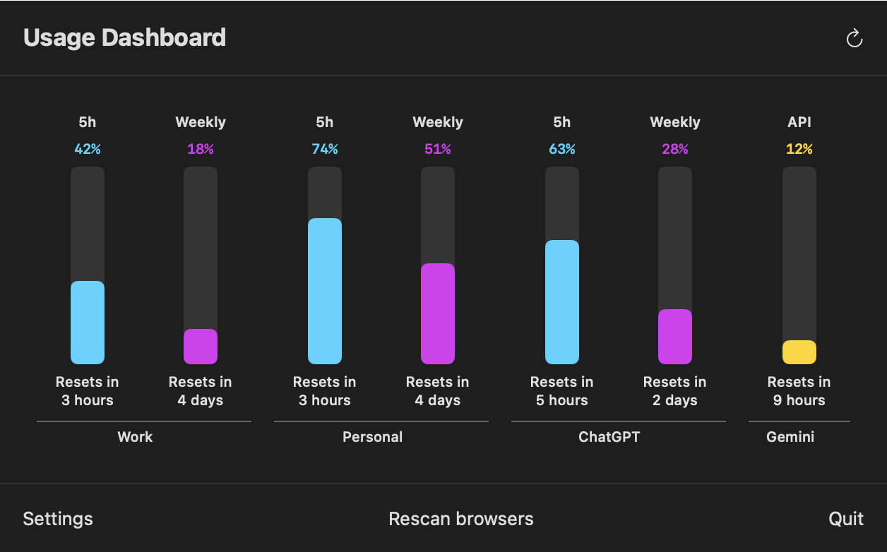

# Pinemeter

**All your AI usage. One glance.**

Pinemeter is a macOS menu bar app that watches every quota that can stop you mid-flow: Claude's 5-hour, weekly, and Fable windows across all your accounts, ChatGPT plan limits, and Gemini API quota data when available. Live meters in the menu bar, an annotated dashboard in the popover, and notifications before you hit a wall.

A [Pineit](https://pineit.ca) project.

<p align="center">
  
</p>

The menu bar shows up to 12 meters in miniature and in popover order. Cyan is a 5-hour window, purple is weekly, yellow is a special or API quota, and any meter at 90% or higher turns red.

<p align="center">
  
</p>

## Features

- **Every quota as a live meter** - one bar per limit, colour-coded by quota type, with reset countdowns and a red near-limit state
- **Multiple Claude accounts** - one click scans your open browsers (Chrome, Safari, Firefox, every profile) and connects each signed-in Claude subscription; 5-hour, weekly, and optional Fable bars per account
- **ChatGPT plan limits** - 5-hour, weekly, and additional plan quota rows imported from your browser session
- **Gemini integration** - connect an API key for quota visibility when Google's response exposes it
- **Account controls** - rename accounts, disconnect them, or exclude them from future browser scans
- **Threshold notifications** - configurable in-app and native macOS alerts for primary Claude 5-hour usage, plus optional reset celebrations
- **Signed in-app updates** - release checks, update notifications, and one-click upgrades from the popover
- **Local JSON export** - `~/.pinemeter/usage.json` for scripts, shell prompts, and dashboards
- **Auto-refresh and launch at login** - updates every 1, 5, or 10 minutes and can start automatically with macOS

## Privacy and security

Your provider credentials stay under your control:

- Browser sessions are imported from your own local browser cookie stores and saved in the **macOS Keychain**, never in files or preferences
- Credentials are sent only to the provider they belong to (claude.ai, chatgpt.com, Google), only to read usage data
- No analytics or telemetry; GitHub is contacted only to check for and download signed updates
- Error messages and logs are sanitized so credential material can never leak into them - enforced by tests (`PinemeterTests/SecurityInvariantTests.swift`)

Pinemeter is not App-Sandboxed because its core import feature reads browser cookie databases, which live outside any app container. Safari imports additionally require Full Disk Access; the app will point you to the right System Settings pane when needed.

## Installation

### Build from source

Requires macOS 14+ and Xcode 16+.

```bash
git clone https://github.com/PineIT-ca/pinemeter.git
cd pinemeter
xcodebuild build \
  -project Pinemeter.xcodeproj \
  -scheme Pinemeter \
  -configuration Release
```

Then copy the built `Pinemeter.app` from the build products directory into `/Applications`.

### First run

1. Launch Pinemeter - a gauge icon appears in the menu bar.
2. Sign in to claude.ai (and optionally chatgpt.com) in your browser.
3. Click the icon and choose **Scan open browsers**. Every detected Claude account and one ChatGPT session are connected.
4. Optionally add a Gemini API key in Settings.

## Usage

- **Popover** - click the menu bar icon for the full dashboard: one labelled column per quota, percentage, reset time, and per-account attribution. **Rescan browsers** in the footer reconnects sessions after they expire.
- **Menu bar** - up to 12 mini meters in popover order. Hover for a tooltip naming each bar.
- **Settings** - accounts, refresh interval, Fable visibility, launch at login, reset celebrations, notification thresholds, and credential management (validate, repair, clear).

### JSON export

Pinemeter writes primary Claude usage to `~/.pinemeter/usage.json` on every refresh, for use in scripts and status lines:

```bash
jq '.session_usage.utilization' ~/.pinemeter/usage.json
```

## Development

```bash
xcodebuild test \
  -project Pinemeter.xcodeproj \
  -scheme Pinemeter \
  -configuration Debug
```

Debug builds include a demo mode with synthetic data, useful for screenshots and UI work without real credentials:

```bash
Pinemeter.app/Contents/MacOS/Pinemeter --demo multiProvider --open-popover-after-launch
```

Modes: `safeUsage`, `warningUsage`, `criticalUsage`, `exceededUsage`, `withFable`, `multiProvider`, `loading`, `error`, `setupWizard`. Add `--render-screenshots <dir>` to write popover and menu bar PNGs and exit.

## License

MIT - see [LICENSE](LICENSE).

Based on [Pinemeter by Edd Mann](https://github.com/eddmann/Pinemeter), also MIT licensed. Multi-account support, the multi-provider bar chart dashboard, and the Pineit branding are additions by [Pineit](https://pineit.ca).
